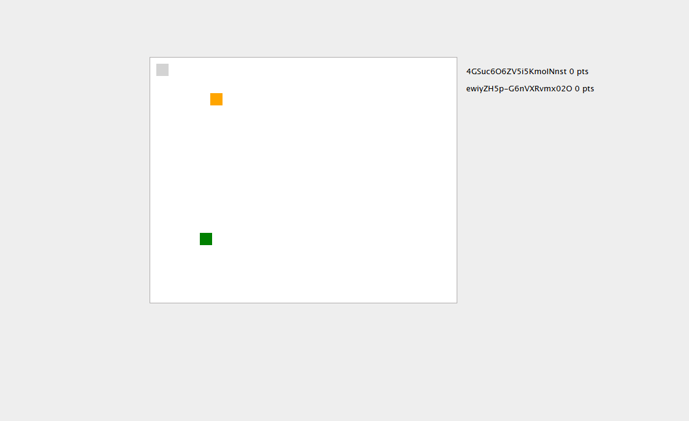

Este é um pequeno jogo multiplayer online baseado no projeto do Filipe Deschamps .
Cada jogador move seu quadrado para coletar frutas verdes em tempo real! 🍏

Tecnologias usadas:

Frontend: HTML5, Canvas, JavaScript

Backend: Node.js, WebSocket (com a biblioteca ws)
